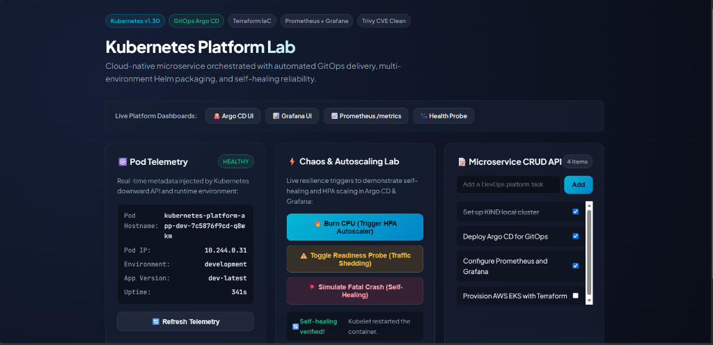

# Kubernetes Platform App

> 🔗 **Part of the [Enterprise Kubernetes Platform Engineering Ecosystem](https://github.com/PandaVerse09/kubernetes-platform-gitops)**  
> • GitOps Control Plane: [kubernetes-platform-gitops](https://github.com/PandaVerse09/kubernetes-platform-gitops)  
> • Cloud Infrastructure: [kubernetes-platform-infra](https://github.com/PandaVerse09/kubernetes-platform-infra)

Stateless, production-ready microservice built with Node.js & Express, instrumented with Prometheus observability and packaged for Kubernetes deployment via GitOps.



## Features
- **Health Probes:** Dedicated `/health` (Liveness) and `/ready` (Readiness) endpoints.
- **Prometheus Observability:** Native `/metrics` endpoint exposing default Node.js runtime metrics and custom HTTP request duration/counter metrics (RED method).
- **CRUD Operations:** RESTful API for tasks (`/api/v1/todos`).
- **Resilience Testing Endpoints:**
  - `POST /api/v1/admin/toggle-ready`: Simulates readiness failure to test traffic draining.
  - `POST /api/v1/admin/crash`: Simulates unexpected process termination to test Kubernetes pod restart and self-healing.
  - `GET /api/v1/admin/cpu-burn?ms=1000`: Generates synthetic CPU spike to test Horizontal Pod Autoscaler (HPA).
- **Security:** Multi-stage Dockerfile running as non-root user (`node`).
- **Automated CI:** GitHub Actions workflow running tests, Trivy vulnerability scanning, and automated GitOps image tag promotion.

## Local Development

```bash
# Install dependencies
npm install

# Run unit and integration tests
npm test

# Start local server
npm run dev
```

## Docker Build & Run

```bash
docker build -t kubernetes-platform-app:local .
docker run -p 8080:8080 kubernetes-platform-app:local
```
